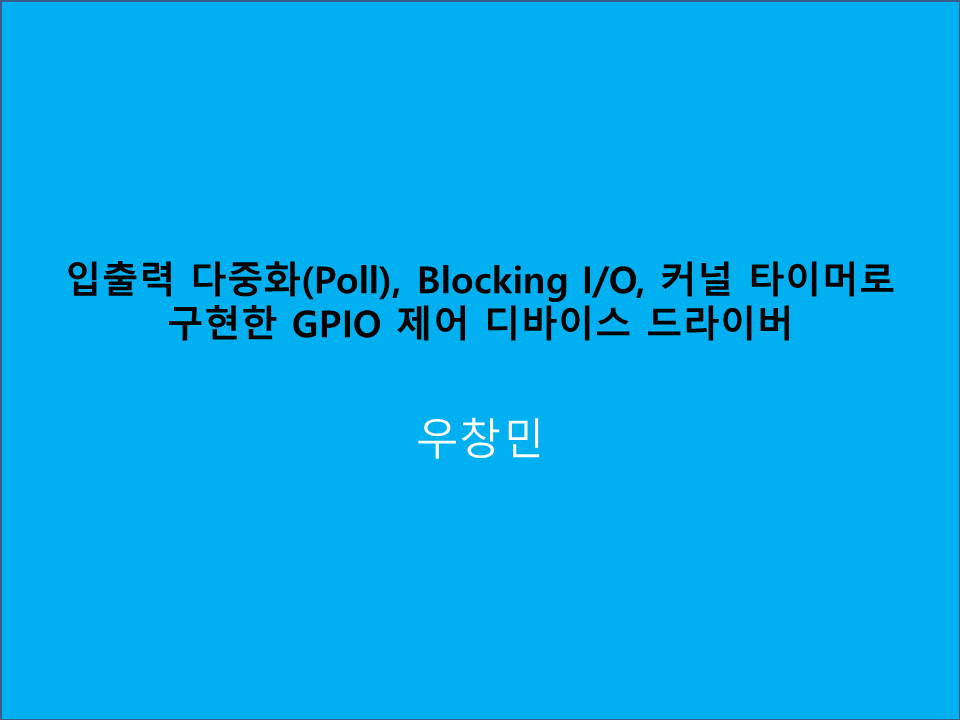

# LinuxBSP_DeviceDriver
입출력 다중화(Poll), Blocking I/O, 커널 타이머로 구현한 GPIO 제어 디바이스 드라이버

 

## Outline
프로젝트 주제: 입출력 다중화(Poll), Blocking I/O, 커널 타이머로 구현한 GPIO 제어 디바이스 드라이버  
 
프로젝트 수행자: 인텔 엣지AI SW개발자 아카데미 3기 우창민 
 
프로젝트 수행기간: 24/2/28   

## Prerequisite

Desktop: Oracle VM VirtualBox - Ubuntu 20.04 X86 
Target Board: Raspberry Pi 4B  - ARM

## How to Use?

[코드 동작](https://program-developers-story.tistory.com/154)  
입력받은 led값에 따라 led가 켜지고, timer의 시간 주기에 따라 반전되서 깜빡입니다. 100이면 1초에 한번씩 0x0f 키고 0xf0키고 번갈아가면서 계속 하는겨 

디바이스 드라이버는 처리할 데이터가 없을경우 프로세스를 대기(sleep) 상태로 전환하고, key 인터럽트 발생 시 wake up하여 준비/실행 상태로 전환하여 처리함.

key1을 누르면 타이머가 정지됩니다.

key2를 누르면 키보드로 커널 타이머 주기를 입력 받습니다.(입력을 100으로 받았다면 1/100을 곱해서 1초에 한번씩 동작하는게 됩니다)

key3을 입력시 led값을 입력받아 변경된 값으로 on/off 또는 'Q' 'q' 입력시 타이머는 멈추고 응용프로세스를 종료합니다.

key4 입력시 타이머가 동작시킵니다.

key8을 입력하면 프로그램이 종료됩니다.  

## Demo Vedio

아래 사진을 누르면 데모 영상 링크로 이동합니다.
 